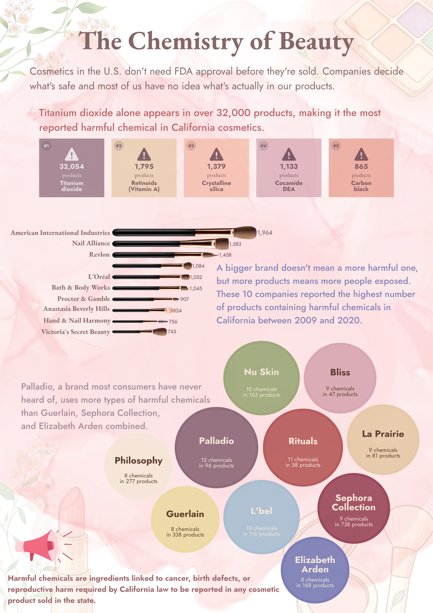

Every morning, millions of people reach for a moisturizer, a foundation, a mascara, a lip gloss, and other cosmetics before 8am. We trust these products completely. They smell good, they feel good, and they come in beautiful packaging. But buried inside many of those sleek bottles and colorful palettes are ingredients that scientists and public health researchers have flagged as potentially harmful.

I had no idea how many of my own products appeared on the California Safe Cosmetics Program (CSCP) list when I first started looking into this. The CSCP is a program run by the California Department of Public Health that requires cosmetic companies selling in California state to report any products containing chemicals linked to cancer, birth defects or reproductive harm. The data set spans over a decade, 2009 to 2020, and includes product names, brands, company names, and the specific chemicals of concern.

I wanted to make cosmetic safety feel real and accessible. Not a dry regulatory table, but something you could actually read and walk away from knowing something new. So I built an infographic around three questions:

**- Which harmful chemicals show up most often across cosmetic products?**

**- Which companies have the largest number of reported products?**

**- Which brands expose consumers to the widest variety of harmful chemicals?**

You can [explore the full dataset here](https://catalog.data.gov/dataset/chemicals-in-cosmetics-d55bf)!

My final infographic is made up of 3 plots, all built using a combination of ggplot and Affinity Designer.

Let's break it down and walk through my thinking for each piece!

## The chemicals that show up everywhere

When I started exploring the data, one question kept coming back to me, which chemicals are hiding in the most products? A standard bar chart felt too clinical for what I was trying to do. I wanted the ranking to feel intuitive, the kind of list you can read in seconds without thinking about axes or scale. So I went with a card-style layout, one card per chemical group, ranked left to right from most to least common.

In ggplot, I used geom_tile() for the card backgrounds and a Font Awesome warning icon to give each card a small hazard symbol. The goal was to keep everything clean and minimal: no axes, no gridlines, just the cards. Here is what came straight out of ggplot:

Then I moved into Affinity Designer, where I added the text, and some finishing polish to the typography. I also used Affinity to fine-tune spacing and make sure the card hierarchy felt right, the `#1` card is the darkest tone, and the cards lighten from left to right to reinforce the rank visually.

## The top 10 companies

Once I knew which chemicals were showing up the most, the next question was natural, who is responsible? For this I went with a simple horizontal bar chart. Company names are long, and a vertical axis always makes them awkward to read, so flipping the chart with `coord_flip()` was the obvious choice.

Each bar gets its own color from the Velvet Dawn palette I built for this project. This isn't encoding any variable — it just keeps the bars visually distinct and stops the chart from feeling flat. I removed the grid entirely and added direct labels at the end of each bar, so there's no squinting at an axis to estimate values.

## Which brands carry the widest chemical variety?

The company bar chart tells you how many products have reported chemicals, but a company with 2,000 flagged products might rely on the same one or two ingredients throughout. The more interesting question is: which brands expose you to the widest variety of harmful chemicals?

To answer that, I counted the distinct harmful chemical groups found across each brand's products, filtered to brands with at least 30 products to avoid small brands skewing the ranking, and took the top 10. I used a packed bubble chart where each bubble's area reflects the number of unique harmful chemical types for that brand.

Bubble charts feel less rigid than bar charts, they invite you to look around the whole canvas rather than read straight down, which felt right for a question about brands you actually recognize. Each bubble is labeled with the brand name and a simple count so there is no guessing involved.

The brand at the top surprised me. It was not Guerlain. It was not Sephora Collection. It was Palladio, a niche mineral makeup brand that most people have never heard of, leading with 12 distinct harmful chemical types across just 96 products.

## Putting it all together

With all three charts built, I moved to affinity to assemble the infographic and think about typography, layout, and accessibility.

#### Colors & typography

I built a custom palette. I'm calling *Velvet Dawn*: muted roses, warm sands, dusty wines, and a soft ivory background. I wanted the palette to feel like the cosmetics world: a little glamorous, not garish, and warm rather than clinical.

The colors aren't perfectly color blind friendly in every combination, but I was careful to never rely on color alone to carry a key message. Every important takeaway is also encoded through position, labels, or text.

For typography, I used **EB Garamond** for titles (elegant and editorial, like something you'd see on a beauty magazine cover), **Jost** for data labels and numbers (clean, modern, geometric), and kept those two families consistent across all three panels. The combination keeps things sophisticated without feeling clinical.

### Layout, context and centering the message

Ordering the three panels deliberately was important to me. You start with *what* (the chemicals), move to *who* (the companies), and end with the comparison (the brand-level variety chart). Each panel naturally raises the next question.

I also wanted to contextualize the data throughout. The annotation on the bubble chart calls out Palladio by name because naming a specific brand makes the finding feel real in a way that an abstract ranking doesn't. And filtering to brands with at least 30 products is something I am informing, so readers understand why they might not see every brand they expected.

### Accessibility

Beyond the color blind check, I added a kept font sizes large enough to read without zooming, and made sure every key message is readable through labels and annotations — not just visual encoding. The bubble chart labels each circle with explicit counts so the size comparison is always backed up by numbers.
