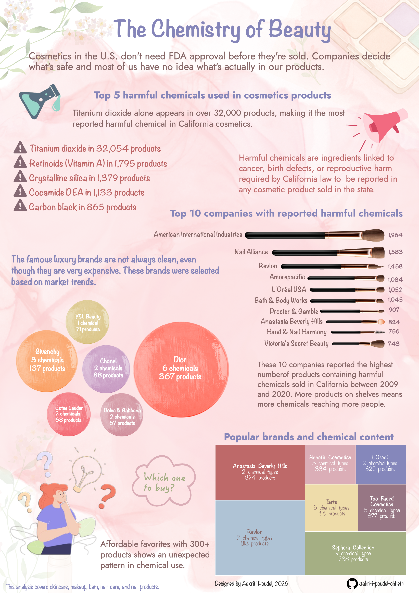
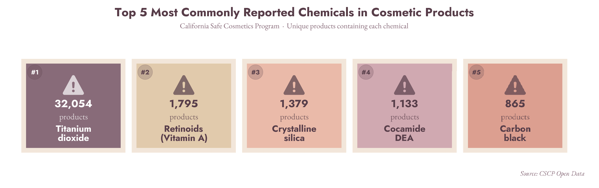

## Introduction

Every morning, millions of people reach for a moisturizer, a foundation, a mascara, a lip gloss, and other cosmetics before 8am. We trust these products completely. They smell good, they feel good, and they come in beautiful packaging. But buried inside many of those sleek bottles and colorful palettes are ingredients that scientists and public health researchers have flagged as potentially harmful.

Cosmetics in the U.S. do not need FDA approval before they are sold. Companies decide what is safe and most of us have no idea what is actually in our products.

## Data

The data comes from the California Safe Cosmetics Program (CSCP), run by the California Department of Public Health. It requires cosmetic companies selling in California to report any products containing chemicals linked to cancer, birth defects, or reproductive harm. The dataset covers 2009 to 2020 and includes over 114,000 records across 36,972 unique products.

I wanted to turn this data into something anyone could read and learn from. So, I built an infographic around following four questions:

**Which harmful chemicals show up most often across cosmetic products?**

**Which companies have the largest number of reported products?**

**Which luxury brands expose consumers to the widest variety of harmful chemicals?**

**Which popular brands has less harmful chemicals?**

You can [explore the full dataset here](https://catalog.data.gov/dataset/chemicals-in-cosmetics-d55bf).

## The Infographic



My final infographic is made up of four visualizations, all built in R using `{ggplot2}` and assembled in Affinity designer.

## Design process

### 1. Graphic form

#### A. The chemicals that show up everywhere

When I started exploring the data, one question kept coming up, which chemicals show up in the most products? A regular bar chart felt too formal for this. I wanted something quick and easy to read, where you can understand the ranking right away without thinking about axes or numbers. So I used a card style layout, with one card for each chemical group, arranged from most to least common.

In {ggplot}, I used `geom_tile()` to make the cards and added a small warning icon to each one. I kept everything simple, no axes, no gridlines, just the cards. You can see the chart from {ggplot} below.




Then I moved into Affinity Designer, and made the **warning icon list** of the top five chemicals. The list keeps the ranking simple and readable. Each entry has the chemical name and the exact product count so the scale is immediately visible.

#### B. Who is responsible?

Once I knew which chemicals showed up the most, the next question was simple, who was responsible for it? For this, I used a **Horizontal bar chart**. The company names are long, and they are hard to read on a vertical axis, so I flipped the chart using `coord_flip()`.

Each bar has its own color from the Velvet Dawn palette I created for this project. The colors do not represent any data. They help keep the bars apart giving a clean look. I removed the grid and added labels at the end of each bar, so you can read the values directly without checking an axis.

#### C. The luxury brands
I wanted to check which luxury brands, the ones we trust the most and pay the most for, actually use the most harmful chemicals. The luxury brands were selected based on the popularity and market trend. I used a **Bubble chart**. To compute the layout, I used `circleProgressiveLayout()` from {packcircles}. To draw the circles as polygons in {ggplot2, I used `circleLayoutVertices()`. Each bubble gets its own color from the Velvet Dawn palette. The brand name sits at the center of each bubble along with the number of chemicals and products.

In Affinity Designer, I styled the bubble chart to look like a blush palette. Each bubble is one brand, sized by number of reported products. Inside each bubble, you can see how many distinct harmful chemical types that brand uses and the number of products.

#### D. The affordable popular brands

For the popular brands, I used **Treemap** . Each box is one brand. These brands were selected based on affordability, market trends and having more than 300 reported products. The size of the box shows how many products that brand has reported. The color shows how many distinct harmful chemical types it uses.

I used `geom_treemap()` and `geom_treemap_text()` from {treemapify}. The brand name, chemical type count and product count are all labeled inside each box so you do not need a legend to read it.

In Affinity Designer, I styled the chart to look like an eyeshadow palette.

### 2. Text (Titles, labels and annotations)

After building all four plots in R, I moved to Affinity Designer to put the infographic together.

Every chart has a title or annotation. I removed all axis titles where the labels already made the meaning obvious. Each bubble in the luxury brand chart is labeled with the brand name, number of chemical types, and number of products so the size comparison is always backed up by numbers. Each box in the treemap works the same way.

The infographic opens with a plain statement of the problem. That sets the context before the reader look at chart. The definition of harmful chemicals is placed next to the top five chemical list. I put it there because that is exactly where a reader may ask “What does harmful chemicals mean?” The annotation is written next to each chart. This will make reader to understand right away.

### 3. Themes
All charts use a my customized color palette as background in R. Once I moved to Affinity Designer, I added a soft pink floral background with decorative elements like flowers, leaves and makeup palette in the corners. The background gives the infographic a cosmetics feel without making it hard to read the data. The charts sit cleanly on top of it because their white backgrounds create enough contrast against the pink texture.

### 4. Colors

I built a custom palette called *Velvet Dawn* with 10 colors: Rose dust, Warm sand, Muted plum, Pale almond, Dusty wine, Hazy sky, Muted olive, Pale butter, Slate indigo, and Dusty brick red. The palette is inspired by the cosmetics world, soft and warm, the kind of colors you would see on a makeup palette.

``` r
palette <- c(
  "rose"   = "#D8A7B1",  # Rose Dust
  "sand"   = "#E6C9A8",  # Warm Sand
  "plum"   = "#8E6A7A",  # Muted Plum
  "almond" = "#F5E6D8",  # Pale Almond
  "wine"   = "#9B4A5A",  # Dusty Wine
  "sky"    = "#A8BED1",  # Hazy Sky
  "olive"  = "#9DA87A",  # Muted Olive
  "butter" = "#EDD9A3",  # Pale Butter
  "indigo" = "#7B7DB5",  # Slate Indigo
  "brick"  = "#B85C5C"   # Dusty Brick Red
)
```
The palette is not perfectly colorblind friendly in every combination. But every key finding in the infographic is also written out directly as a label, annotation, or count. You can read every chart without relying on color at all.

### 5. Typography

I used two fonts throughout the infographic.
    - Jost for subheadings and paragraphs. It is clean and easy to read at small sizes.
    
    - Noteworthy for the title, labels, and annotations. It gives the infographic a handwritten, personal feel that fits the cosmetics theme.

Jost was loaded in R using `font_add_google()` from {sysfonts} and activated with `showtext_auto()`. Noteworthy is in Affinity Designer.

### 6. General design
You start with what chemicals are showing up the most, move to which companies are responsible, then see how luxury brands compare, and end with the popular brands treemap. Each section raises the next question naturally.

The woman thinking "Which one to buy?" sits at the bottom left as the closing moment. After seeing all the data, that is the question every reader has on their mind.

The luxury brand bubble chart was filtered to six brands selected based on market trends. The popular brands treemap was filtered to brands with more than 300 reported products, selected based on affordability and market trends.

### 7. Contextualizing the data
The infographic opens with a clear statement of the problem. This helps readers understand why the data matters before they look at the charts. The short information of harmful chemicals is also stated directly in the infographic.

### 8. Main message
The main message is harmful chemicals are common in cosmetics at every price level. Expensive luxury brands are not always cleaner, even though they cost more. At the same time, more affordable products also show surprising patterns.
The woman thinking "Which one to buy?" at the bottom brings it back to the reader personally. Every chart tries to build the case.

### 9. Accessibility
The font sizes are large enough to read without zooming. All the key finding is backed up by explicit labels and counts, not just visual size or color. The bubble charts and treemap all have brand names, chemical counts, and product counts written directly on them so no finding depends on color or size alone. Alt text is provided for the infographic image.

### 10. DEI lens
The data covers products reported to the CSCP between 2009 and 2020. It only reflects what companies chose to report. Some companies may have underreported, which means the real picture could be worse than what the data shows.

The infographic is written for everyday shoppers, not scientists or regulators. The language is kept simple so anyone can read it and walk away knowing something useful about the products they buy.

## Reflections
Expensive does not mean clean. Even when we pay more, the product likely contains at least one harmful chemical. For luxury brands, Dior leads with 6 chemical types and 367 reported products, more than Chanel, Givenchy, or Estee Lauder. Price is not a reliable signal of how safe a product is.

The hardest part of this project was cleaning the brand names and deciding on the right visualization for each question. The raw dataset has 2,573 unique brand name entries. Same brand name has different entries such as "Parfums Chrisitian Dior", "Parfums Christain Dior", and "Parfums Christian Dior" with different typos. Collapsing those variants using `str_detect()` inside `case_when()` took more time than building any single chart.

The cosmetics themed design came together in Affinity Designer after all the charts were built in R. Laying the makeup brush over the bar chart and styling the bubble and treemap charts as blush and eyeshadow palettes made the infographic visually appealing. 
